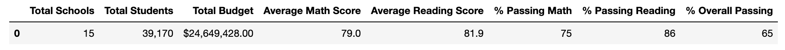
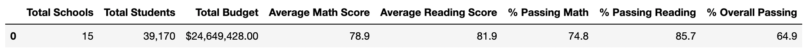
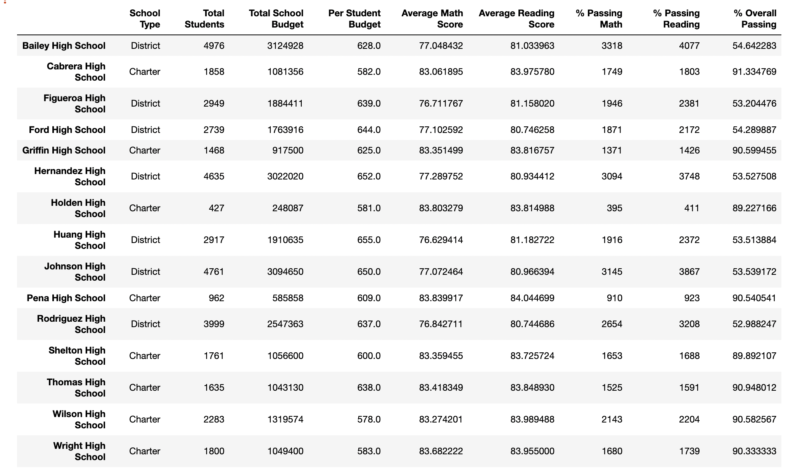
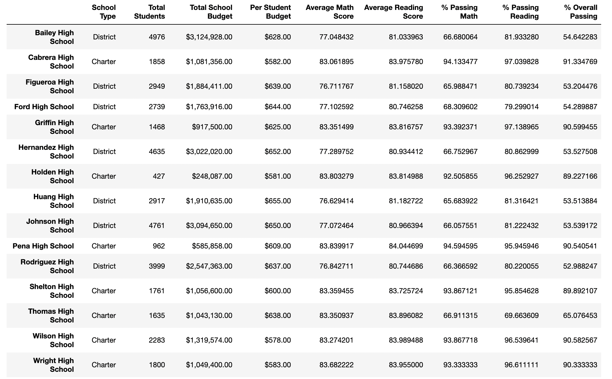

# School_District_Analysis

## Overview 
In this module, we helped Maria perform an analysis on on data from different schools in the distict to present to the school board. 

## Resources 
* Data Source: schools_complete.csv, students_complete.csv
* Software: Python , Jupyter, Conda 

## Results 
In this challenge, Maria found that data from Thomas High School was altered and was no longer correct. Here are the impact of the corrections. 

### Deliverable 1 

### Deliverable 2

### District Summary 

#### Before District Summary 

#### After District Summary 

### School Summary

#### Before School Summary 

#### After School Summary 

### High and Low Performing Schools 

### Math and Reading Scores by Grade

### Scores by School Spending 

### Scores by School Size

### Scores by School Type 

## Summary 
