# School_District_Analysis

## Overview 
In this module, we helped Maria perform an analysis on data from different schools in the distict to present to the school board. 

## Resources 
* Data Source: schools_complete.csv, students_complete.csv
* Software: Python , Jupyter, Conda 

## Results 
In this challenge, Maria found that data from Thomas High School was altered and was no longer correct. Below is the impact of the corrections. 

### Deliverable 1 
For deliverable 1, we replaced every Thomas High School 9th grader's test scores with NaN. 

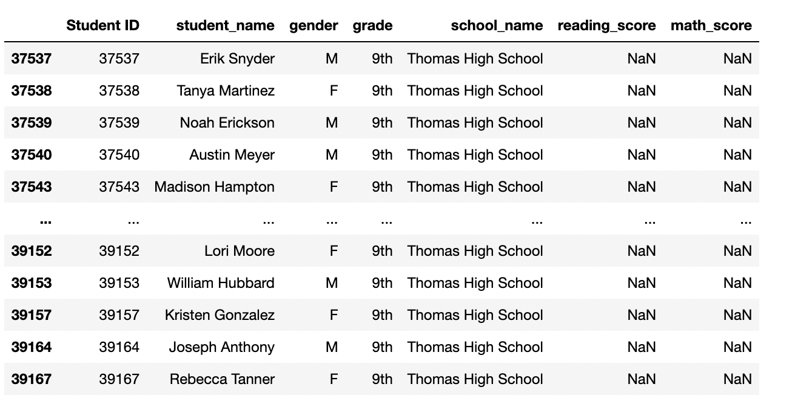

### Deliverable 2

### District Summary 
There wasn't a huge change in the district summaries. 
#### Before - District Summary 

#### After - District Summary 

### School Summary
You can see the biggest change here looking at Thomas High School. The overall passing percent went from 90.58% to 65.08%. 
#### Before - School Summary 

#### After - School Summary 

### High and Low Performing Schools 
There was not a major change in top or bottom schools. 
#### Before Top Schools 
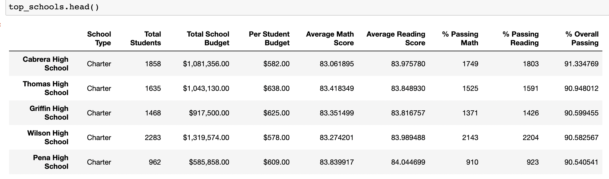

#### After Top Schools 
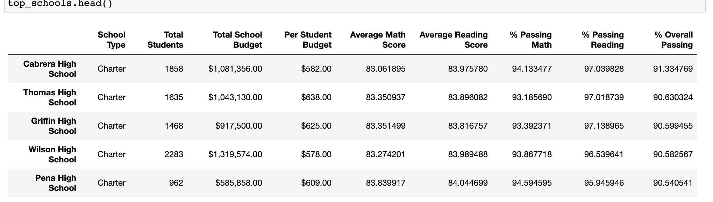

#### Before Bottom Schools 
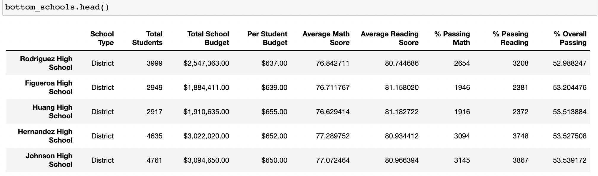

#### After Bottom Schools 
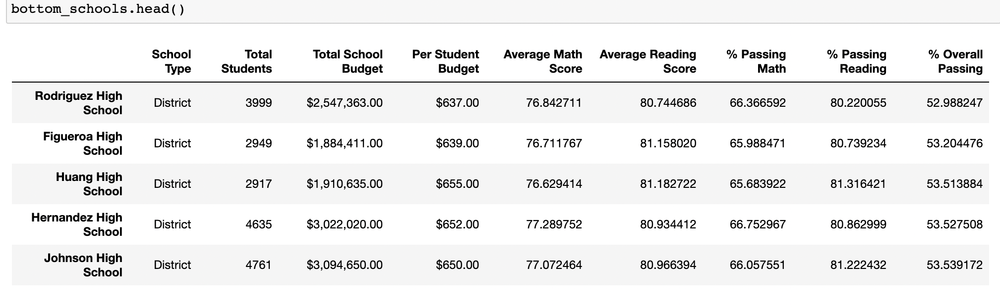

### Math and Reading Scores by Grade
In the challenge, we now see that Thomas High School shows NaN values for 9th grade test scores. 
#### Before Math Scores
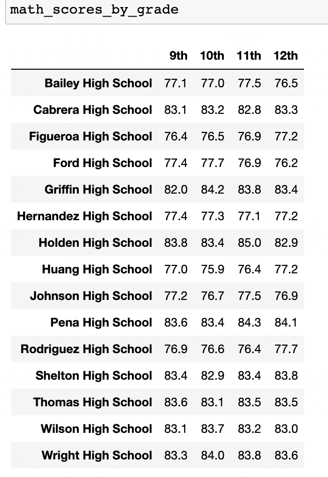 

#### After Math Scores
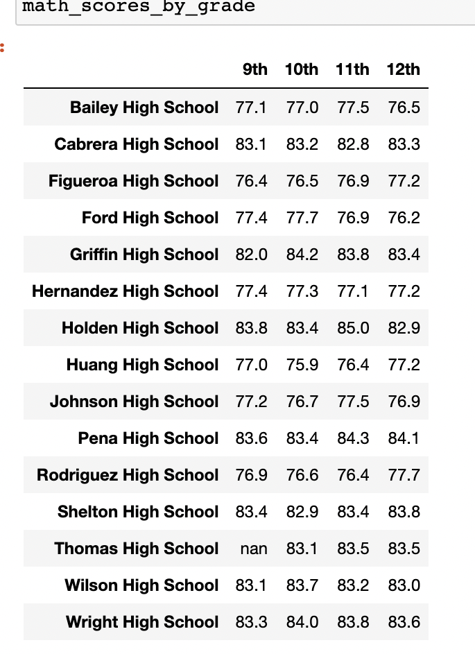 

#### Before Reading Scores
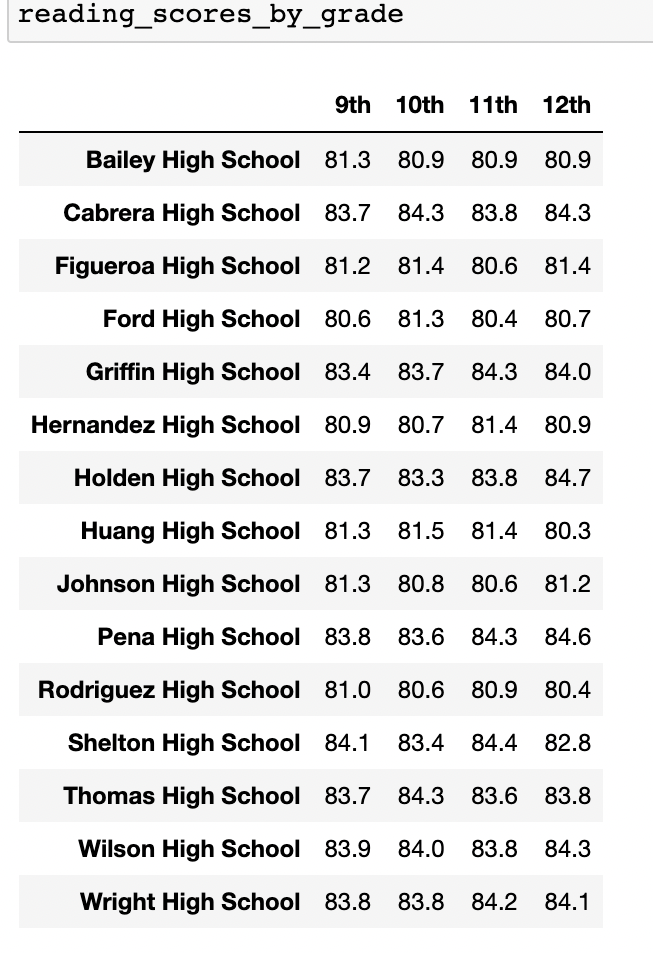

#### After Reading Scores 
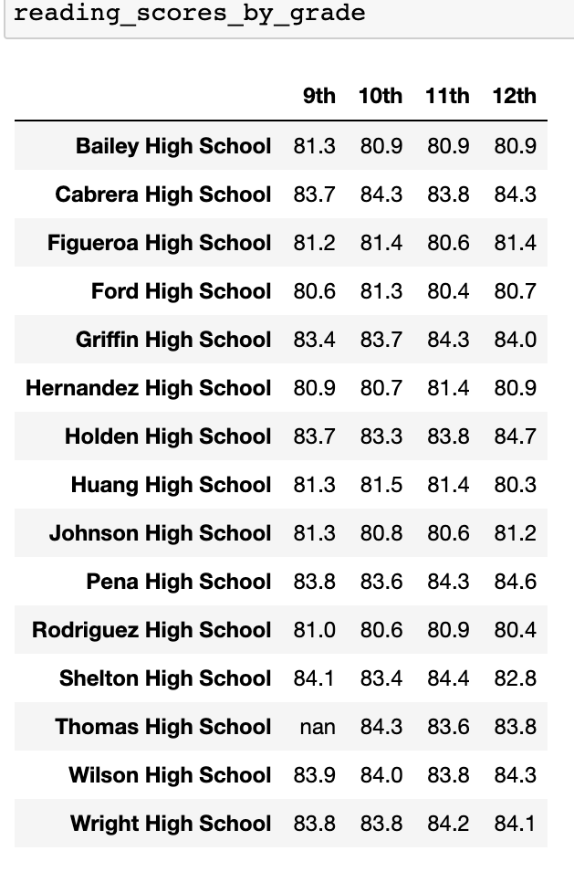

### Scores by School Spending 
No major change in school spending. 
#### Before - School Spending 

#### After - School Spending 
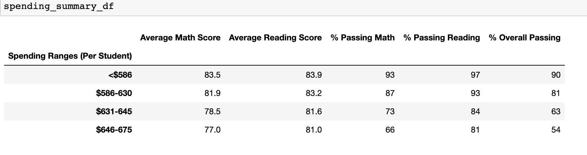

### Scores by School Size
No major change in school size data.
#### Before - School Size

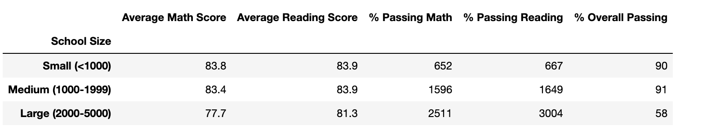

#### After - School Size 
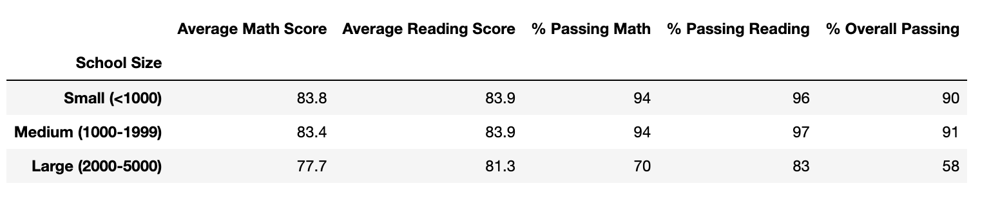

### Scores by School Type 
No major change in school type data. 
#### Before - School Type
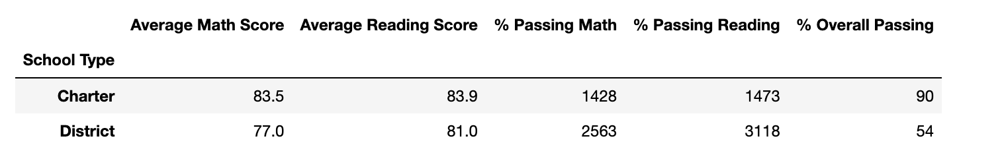

#### After - School Size 
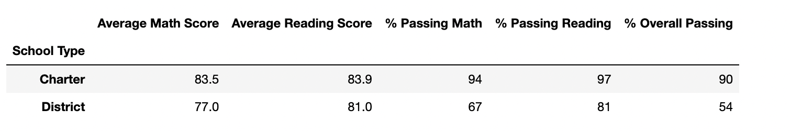

## Summary 
There were no considerable differences after taking the falsified data from Thomas High School. The only notable differences were when we looked closely at Thomas High School data. 
