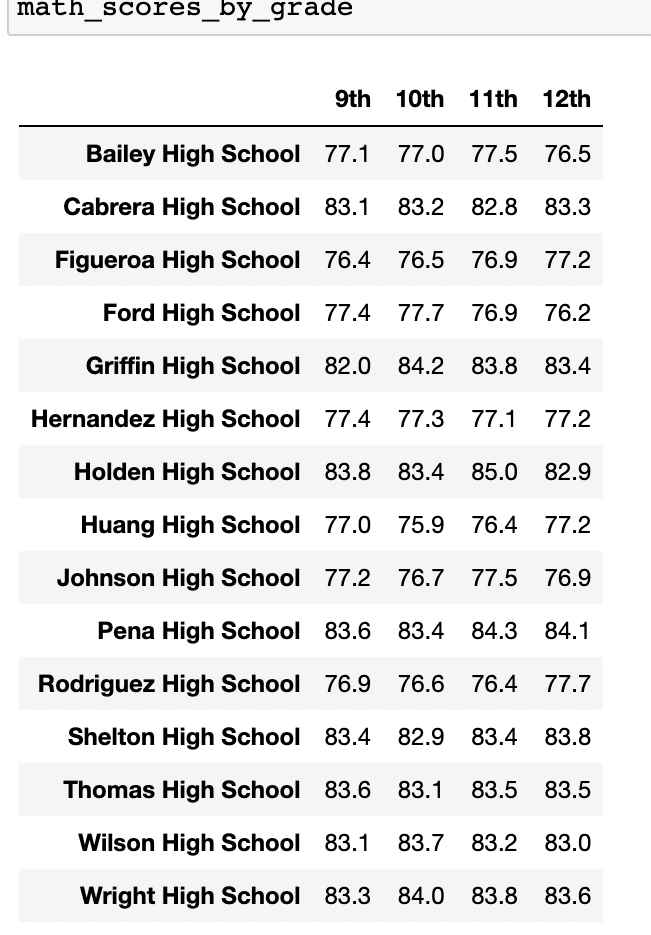
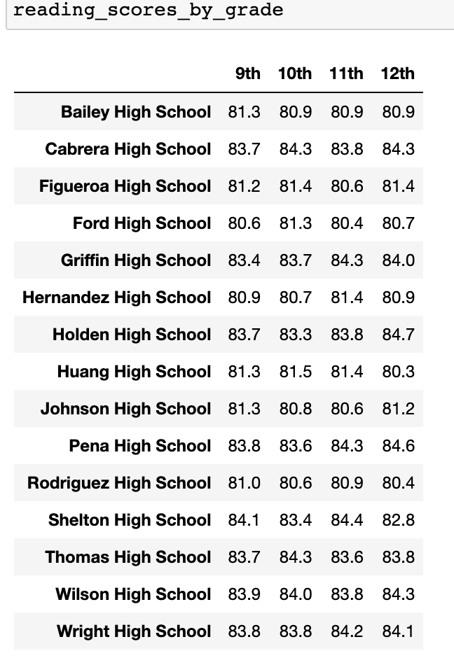

# School_District_Analysis

## Overview 
In this module, we helped Maria perform an analysis on on data from different schools in the distict to present to the school board. 

## Resources 
* Data Source: schools_complete.csv, students_complete.csv
* Software: Python , Jupyter, Conda 

## Results 
In this challenge, Maria found that data from Thomas High School was altered and was no longer correct. Here are the impact of the corrections. 

### Deliverable 1 

### Deliverable 2

### District Summary 

#### Before District Summary 

#### After District Summary 

### School Summary

#### Before School Summary 

#### After School Summary 

### High and Low Performing Schools 

#### Before Top Schools 

#### After Top Schools 

#### Before Bottom Schools 

#### After Bottom Schools 

### Math and Reading Scores by Grade

#### Before Math Scores
 

#### After Math Scores
 

#### Before Reading Scores

#### After Reading Scores 

### Scores by School Spending 
#### Before - School Spending 

#### After - School Spending 

### Scores by School Size
#### Before - School Size

#### After - School Size 

### Scores by School Type 
#### Before - School Type

#### After - School Size 

## Summary 
